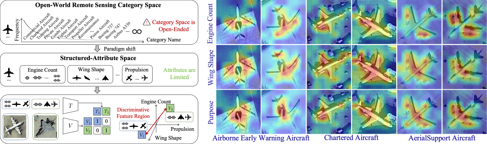
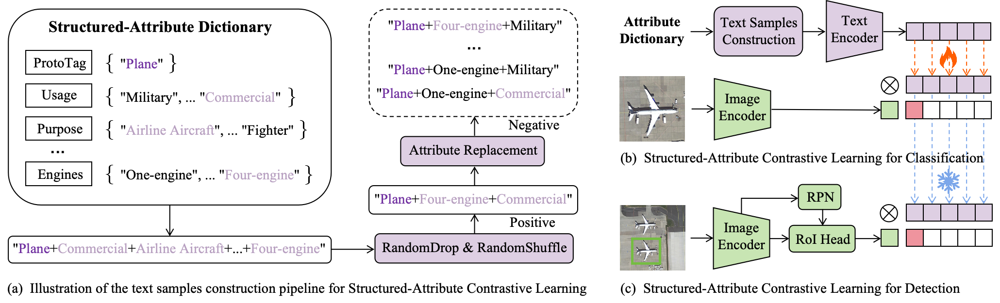

# SLIP-RS: Structured-Attribute Language-Image Pre-Training for Remote Sensing Object Detection


## Abstract
Existing language-image pre-training methods for remote sensing object detection are constrained by Monolithic Label Learning, which relies on exhaustively enumerating open-set categories via black-box data to acquire fine-grained representations. This paradigm introduces a strong dependency on large-scale labeled data, which is fundamentally incompatible with the inherent data scarcity in remote sensing scenarios.
To transcend this bottleneck, we propose **SLIP-RS**, a **Structured-Attribute Decoupling Paradigm** that maps the open-ended category space into a finite and physically meaningful attribute space. This formulation enables fine-grained discriminability through explicit structural reasoning.
Our approach is built upon two key technical pillars:
- **Structured-Attribute Contrastive Learning (SACL).** Enforces the learning of disentangled intrinsic visual representations via combinatorial attribute augmentation.
- **Conformal Attribute Reliability Engine (CARE).** Leverages conformal prediction theory to distill high-fidelity supervision from noisy data sources, resulting in RS-Attribute-15M, the largest remote sensing attribute dataset with over 15 million annotations.

Extensive experiments demonstrate that **SLIP-RS** achieves state-of-the-art performance in both fine-grained object detection and cross-domain generalization.

<p align="center">
  
</p>

---


## Approach
<p align="center">
  
</p>

---


## (b) SACL for Classification

We construct a structured-attribute classification dataset covering three primary remote sensing categories: plane, ship, and vehicle, and use it to fine-tune a RemoteCLIP-ViT-B model.
This classification stage serves two purposes:
- **Pseudo-label generation for CARE.** The fine-tuned model is used as the teacher to produce high-quality attribute pseudo-labels in the Conformal Attribute Reliability Engine (CARE).
- **Text encoder initialization for detection.** The aligned text encoder learned through SACL is directly reused to initialize the text branch of the downstream detection model, enabling effective vision-language alignment at the attribute level.

### Environment
```bash
cd RemoteCLIP_ft
conda create -n remoteclip_ft python=3.10 -y
conda activate remoteclip_ft

pip install torch==2.4.1 torchvision==0.19.1 torchaudio==2.4.1 \
  --index-url https://download.pytorch.org/whl/cu121

pip install -r requirements.txt
```

### Data
Please download the dataset via [Baidu Cloud](https://pan.baidu.com/s/1XNscwBdndGjwih_zk8EzfQ)(udnm) and organize the dataset as follows:

```bash
RemoteCLIP_ft/
├── DATA/
│   ├── RS_Attri_Cls/
│   │   ├── train/
│   │   │   ├── image/
│   │   │   └── label/
│   │   └── test/
│   │       ├── image/
│   │       └── label/
```

### Pretrain Weights
Please download the following pretrained checkpoints:
- **RemoteCLIP ViT-B-32** from [RemoteCLIP repository](https://github.com/ChenDelong1999/RemoteCLIP?utm_source=chatgpt.com)  
  → download: `RemoteCLIP-ViT-B-32.pt`
- **OpenAI CLIP ViT-B-32** from [OpenAI CLIP repository](https://github.com/openai/CLIP?utm_source=chatgpt.com)  
  → download: `ViT-B-32.pt`

After downloading, put them in `pretrain_weights` folder.


### Train
```bash
bash ./scripts/train_dist.sh
```
Our fine-tuned **RemoteCLIP-FG** checkpoint can be downloaded from:
[Google Drive](https://drive.google.com/file/d/1cEgcDZsyNZWRYzasrCKexooWd85EVcJu/view?usp=sharing&utm_source=chatgpt.com)


## (c) SACL for Detection


### Enviroment
```bash
conda create -n sliprs python==3.10 -y
conda activate sliprs
cd mmdetection_sliprs
ip install torch==1.13.0+cu116 torchvision==0.14.0+cu116 torchaudio==0.13.0 --extra-index-url https://download.pytorch.org/whl/cu116
pip install -U openmim
mim install mmcv-full==1.7.1
cd mmdetection_sliprs
pip install -v -e .
pip install ftfy regex numpy==1.26.1 yapf==0.40.1
```

### Data

SLIP-RS is trained on both open-source remote sensing datasets and large-scale curated datasets:

1. RS-O: 

- **DOTA-v2.0**. Please download the images and horizontal bounding box annotations from the official [DOTA dataset website](https://captain-whu.github.io/DOTA/dataset.html?utm_source=chatgpt.com). After downloading, preprocess the dataset by slicing large images into patches following the official tools provided by [MMRotate DOTA tools](https://github.com/open-mmlab/mmrotate/tree/main/tools/data/dota?utm_source=chatgpt.com). Then, convert the original TXT annotations into COCO-format JSON annotations. RS-O includes all train set.
- **DIOR**. Please download from [DIOR](https://gcheng-nwpu.github.io/#Datasets). Then, convert the original XML annotations into COCO-format JSON annotations. RS-O includes all trainval set.
- **Others**. Other open-source datasets included in RS-O can be downloaded from:[Baidu Cloud](https://pan.baidu.com/s/1-XQ69xTzGCdFlot_QzCnJg)(code: 7gcj)

2. RS-O-Attri

- The attribute annotations for RS-O can be downloaded from:[Baidu Cloud](https://pan.baidu.com/s/1Rlvk5j3XUR7XHDsjN8whCg)(code: 68yx)

3. RS-C & RS-C-Attri

- The large-scale curated dataset and its corresponding attribute annotations can be downloaded from:[Baidu Cloud](https://pan.baidu.com/s/1gI0BLTuWXMYmuMpm5G98tA)(code: kuw9). 
Some large files (e.g., `Asia`) are split into multiple parts. Please merge them using:

    ```bash
    cd Asia
    cat Asia.zip.part* > Asia.zip
    ...
    ```

4. Test Data

- **DOTA-v2.0**. Please download the images and horizontal bounding box annotations from the official [DOTA dataset website](https://captain-whu.github.io/DOTA/dataset.html?utm_source=chatgpt.com). After downloading, preprocess the dataset by slicing large images into patches following the official tools provided by [MMRotate DOTA tools](https://github.com/open-mmlab/mmrotate/tree/main/tools/data/dota?utm_source=chatgpt.com). We use all val set to test the performance of DOTA-v2.0.
- **DIOR**. Please download from [DIOR](https://gcheng-nwpu.github.io/#Datasets). We use all test set to test the performance of DIOR.
- **Attri_test**. The attribute annotations for Attri_test can be downloaded from:[Baidu Cloud](https://pan.baidu.com/s/1m6Nvq_i9MBShpGWbA3lYrQ)(code: snmm)

Finally, organize the dataset as follows:
```bash
path/to/your/data/
├── dota2/
│   ├── images/
│   ├── dota2_train_label.json
│   └── dota2_val_label.json
│ 
├── dior/
│   ├── trainval_images/
│   ├── dota2_train_label.json
│   ├── test_images/
│   └── dota2_test_label.json
│ 
├── RS_O/
│   ├── aitod2/
│   │   ├── images/
│   │   └── annotations.json
│   ├── dronevehicle/
│   │   ├── images/
│   │   └── annotations.json
│   │
│   │  ......
│   │
│   └── simd/
│       ├── images/
│       └── annotations_one.json
│
├── RS_Attri_O/
│   ├── images/
│   └── annotations.json
│
├── RS_C/
│   ├── Asia/
│   │   ├── images/
│   │   └── annotations.json
│   │   └── annotations_attribute.json
│   ├── Europe/
│   │   ├── images/
│   │   └── annotations.json
│   │   └── annotations_attribute.json
│   ├── North_America/
│   │   ├── images/
│   │   └── annotations.json
│   │   └── annotations_attribute.json
│   ├── Others/
│   │   ├── images/
│   │   └── annotations.json
│   ├── Others1/
│   │   ├── images/
│   │   └── annotations.json
│   └── Others_Attri/
│       ├── images/
│       └── annotations.json
│ 
└── Attribute_test/
    ├── plane/
    │   ├── images/
    │   └── annotations.json
    ├── ship/
    │   ├── images/
    │   └── annotations.json
    └── vehicle/
        ├── images/
        └── annotations.json
```

### Pretrain Weights
Please download the following pretrained checkpoints:
- **DINOv3-ConvNeXT-Tiny** from [DINOv3 repository](https://github.com/facebookresearch/dinov3)  
  → download: `DINOv3-ConvNeXT-Tiny`
- **DINOv3-ConvNeXT-Large** from [DINOv3 repository](https://github.com/facebookresearch/dinov3)  
  → download: `DINOv3-ConvNeXT-Large`
- **RemoteCLIP-FG** Our fine-tuned **RemoteCLIP-FG** checkpoint can be downloaded from:
[Google Drive](https://drive.google.com/file/d/1cEgcDZsyNZWRYzasrCKexooWd85EVcJu/view?usp=sharing&utm_source=chatgpt.com)

After downloading, put them in `model_weights` folder.

### Train
```bash
bash ./tools/dist_train.sh ./sliprs_configs/slip-rs_convnext-t_lora-clip_fpn_1x_rs-attri.py 8
```

### Test
Our pretrained model weights:
| Model     | Weight                                                                                                  |
|-----------|---------------------------------------------------------------------------------------------------------|
| SLIP-RS-T | [Pretrained Weight](https://drive.google.com/file/d/1_upTH-zclhUcB_CrS3iYuUAiuN5Y153x/view?usp=sharing) |
| SLIP-RS-L | [Pretrained Weight](https://drive.google.com/file/d/1enHOD4X827pgObkUG45hU9H6bPtiixeL/view?usp=sharing) |


```bash
bash ./tools/dist_test.sh ./sliprs_configs/slip-rs_convnext-t_lora-clip_fpn_1x_rs-attri.py ./path/to/SLIP_RS_T.pth 8 --eval bbox
```

### Visualization
```bash
python ./tools/sliprs_infer_visualize.py ./sliprs_configs/slip-rs_convnext-t_lora-clip_fpn_1x.py ./path/to/SLIP_RS_T.pth ./tools/plane.png --prompt ['plane+twin-engines', 'plane+four-engines'] --out-dir ./
```

You can test using any number and combination of the attributes found in the following dictionary, arranged in any order:
```bash
attri_dict = {"Plane" : {'Engine position': ['At wing roots and lower fuselage', 'Beneath the wings',
                                            'On the nose', 'Rear fuselage', 'Above the wings', 'Embedded within wing'],
                        'Number of engines': ['Eight-engine', 'Four-engine', 'One-engine', 'Twin-engine', 'Ten-engine'],
                        'Propulsion type': ['Jet', 'Propeller'],
                        'Purpose': ['AerialSupport Aircraft', 'Airborne Early Warning Aircraft', 'Airline Aircraft',
                                    'Anti-Submarine Warfare Aircraft', 'Bomber', 'Chartered aircraft', 'Fighter',
                                    'Propeller', 'Trainer', 'Transport Aircraft', 'Attack aircraft'],
                        'Usage': ['Civilian Aircraft', 'Commercial Aircraft', 'Military Aircraft'],
                        'Wing configuration': ['Straight wing', 'Swept delta wing', 'Swept diamond-like wing',
                                                'Swept wing', 'Swept, variable-sweep wing', 'Flying wing']},
            "Ship" : {'Usage': ['Civilian Ship', 'Commercial Ship', 'Engineering Ship', 'Military Ship'],
                        'Subcat': ['Barge', 'Container Ship', 'Dry Cargo Ship',
                                    'Cruise Ship', 'Liquid Cargo Ship', 'RoRo', 'Yacht'],
                        'Purpose': ['Aircraft Carrier', 'Amphibious Ship', 'Auxiliary Ship', 'Cargo Ship', 'Commander', 
                                    'Cruiser', 'Destroyer', 'Frigate', 'Landing', 'Medical Ship', 'Military Transport Ship', 
                                    'Passenger Ship', 'Patrol', 'Submarine', 'Test ship', 'Training ship', 'Tugboat',
                                    'Fishing Vessel', 'Motorboat']},
            "Vehicle" : {'Purpose': ['Bus', 'Cargo Truck', 'Dump Truck', 'Excavator', 'Pick-up', 'Small Passenger Car',
                                     'Tractor', 'Truck Tractor', 'Van'],
                         'Usage': ['Engineering Vehicle', 'Large Civilian Vehicle', 'Small Civilian Vehicle', 'Truck']}}
```
